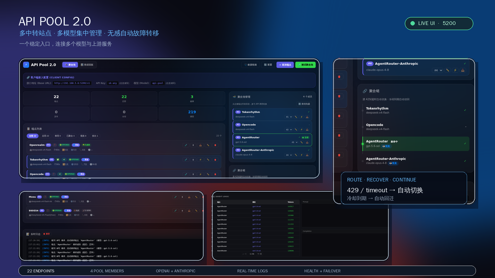

# API Pool

一个轻量、零依赖的多模型 API 聚合网关与 Endpoint 路由管理工具。



> **定位**：API Pool 2.0 对外提供稳定的 OpenAI-compatible 入口（Chat Completions 与
> Responses 两种协议），对内按 Endpoint 配置进行分组路由、协议转换、健康管理、故障转移
> 和统计。Endpoint 可以使用不同的模型和协议，不要求整个池只服务于某一种模型。


---

## 核心功能

- **Endpoint 集中管理** — UI 可视化维护多个上游 Endpoint，各自配置 URL、Key、模型、协议、代理和兼容参数
- **池组隔离路由** — 端点可加入多个分组，每个分组独立维护选择器、优先级、当前端点与兜底锁；子组端点失效时可回落到 main 组，手动切换只影响当前组
- **自动健康检测** — 内置周期性连通性检测和 Endpoint 状态管理，避免把请求持续发送到不可用上游
- **优先级调度与故障转移** — 按 priority 选择 Endpoint，支持失败重试、冷却、恢复探活和自动回迁
- **手动切换（⚡）** — 端点卡片一键把目标端点设为该组当前工作端点，并按真实请求结果重新判定其状态（含解冻）
- **延迟回迁（Deferred Failback）** — 上游恢复后可延迟回迁，减少切换造成的 prompt cache 损失；当前端点再次故障时，延迟回迁端点仍可作为故障转移目标；支持 Endpoint 级开关 `deferrable`
- **上下文长度限制（Endpoint 可选）** — 配置 `max_context_k` 后，超出 Endpoint 上限的请求会跳过该 Endpoint
- **多协议入口与上游桥接** — 入站支持 `/v1/chat/completions` 与 `/v1/responses`；上游 Endpoint 可按 `openai` / `anthropic` / `responses` 三种协议接入并在同一次请求内跨协议桥接。已验收文本、流式、工具调用、多轮工具结果、跨协议工具历史、base64 PNG 图片和 Hermes 实际工具循环，详见 [`docs/anthropic-compatibility-matrix.md`](docs/anthropic-compatibility-matrix.md)
- **视觉池组** — 图片转译的候选来源是专用分组（`role: vision`，全池唯一），不再从请求所在组内任意抓取视觉端点；该分组无可用成员时图片原样转发
- **工具调用兼容** — 支持 tool call 转换、工具结果回传，以及按 Endpoint 配置 `tool_call_id_prefix` 修正跨上游切换后的 ID 格式
- **客户端伪装（client_profile）** — Endpoint 级出站头伪装，三态：透传客户端原头 / `auto` 按入站客户端 UA 自动匹配 profile / 指定静态 profile；用于通过上游的客户端指纹校验
- **入口敏感词过滤** — 请求进入路由前统一清洗已知字段，覆盖普通消息、多模态文本、reasoning、消息名称和工具调用参数；范围可配置，默认不扫描整个 payload；管理面板 `🛡 敏感词过滤` 可视化维护并热重载
- **独立入口与内部路由** — Hermes 只需连接稳定的 `api-pool` 入口模型名，API Pool 2.0 使用目标 Endpoint 自己的 `model` 转发
- **统计大盘** — Token 消耗、缓存命中、请求数趋势；「异常」统计卡可点击筛选异常端点
- **零依赖** — 只需 Python 3.13，单文件即可运行

## 快速开始

```bash
git clone https://github.com/849506054/api-pool.git
cd api-pool
python api_pool_server.py
```

启动后（默认端口 `5100`，可用 `API_POOL_PORT` 覆盖）：

- 管理面板：http://localhost:5100
- API 入口：http://localhost:5100/v1/chat/completions

在管理面板添加 Endpoint 并点「📥」入池后，用分组入口模型名调用：main 组为 `api-pool`，其他分组的选择器见分组标签与 `GET /v1/models`。

完整使用说明见 [Wiki](https://github.com/849506054/api-pool/wiki)。

## 入口敏感词过滤

API Pool 可在请求进入 Endpoint 路由前执行一次统一清洗，避免同一份请求在重试或故障转移时重复处理。过滤器只修改请求副本，不改变客户端原始 payload；词典加载或执行失败时拒绝请求，不会降级放行未清洗内容。

规则在管理面板右上角 `🛡 敏感词过滤` 中可视化维护，保存后服务端**热重载生效，无需重启**。

### 私有配置文件

过滤器配置文件为运行环境中的客户私有文件：

```text
content_filter.json
```

该文件包含客户自定义规则，已被 `.gitignore` 排除，**不会提交到 Git**。生产环境以宿主机当前文件为唯一事实源。部署代码时不要用工作区副本整体覆盖它；如需调整扫描范围，应在宿主机现有配置基础上只修改 `targets` 等字段，原样保留 `rules`。

### 配置示例

下面示例只展示结构。实际敏感词规则应在客户私有配置中维护，不要把真实规则提交到仓库：

```json
{
  "content_filter": {
    "enabled": true,
    "dictionary_version": "2026-08-24",
    "targets": [
      "messages.content",
      "messages.text_blocks",
      "messages.reasoning",
      "messages.name",
      "messages.tool_call_arguments"
    ],
    "rules": [
      {
        "type": "literal",
        "pattern": "client-private-pattern",
        "replacement": "safe-replacement"
      },
      {
        "type": "regex",
        "pattern": "private[-_]pattern",
        "replacement": "safe replacement"
      }
    ]
  }
}
```

### 扫描范围

当前推荐的精确 targets：

| target | 扫描内容 |
|---|---|
| `messages.content` | `messages[].content` 字符串，覆盖所有消息角色 |
| `messages.text_blocks` | 多模态消息中的 `content[].text` |
| `messages.reasoning` | `reasoning_content` 和 `reasoning_text` |
| `messages.name` | `messages[].name` |
| `messages.tool_call_arguments` | `tool_calls[].function.arguments` 的 JSON 值；不修改 JSON key |

`all_strings` 会递归扫描 payload 中全部字符串值，包括工具名称、Schema 的 `enum/default`、顶层 metadata 等非目标字段。它适合排查漏网字段，**不建议长期作为生产默认值**，因为扫描范围更大、开销更高，也可能改写执行数据。

`tools.descriptions` 仅在有实际命中证据时启用。每次收窄范围后，应确认上述已知区域仍能过滤，工具名称、Schema 和顶层 metadata 等非目标字段保持原样。

### 维护与部署注意事项

- 改配置优先走管理面板或管理 API：`GET /api/content-filter` 读取、`PUT /api/content-filter` 保存（写前时间戳备份 → 原子写 → 热重载校验，结构无效自动回滚并返回 400）、`POST /api/content-filter/test` 用样例文本试跑当前规则。
- `content_filter.json` 是客户私有配置，不进入 Git 流程；规则原文不得写入 README、源码、测试或日志。
- 工具层可能对敏感词 `pattern` 自动脱敏。写入规则时，必须避免让待替换的 `pattern` 被错误改写；禁止把经过脱敏的工作区副本当成生产词典。
- 部署前后应比较每条规则的类型、pattern/replacement 长度和脱敏后的 SHA-256 指纹，不打印规则原文。
- 如果预期是替换规则，却出现 `pattern == replacement`，应立即停止部署并从宿主机备份恢复规则，再只做字段级修改。

## 池组与选择器

- 每个分组对外暴露一个**选择器**（客户端填写的模型名）：`mixed` 组的选择器由组定义（缺省=组名），`dedicated` 组的选择器就是绑定的真实模型名。
- `main` 组始终存在，类型固定 `mixed`、选择器固定 `api-pool`；不做特殊分组的端点默认归入 main 组。
- 每个分组独立维护：当前端点指针、手动切换、组内优先级（`priority_by_group`）、延迟回切锁与兜底锁。子组端点全部失效时按优先级回落 main 组端点；手动切换只影响当前组。
- `GET /v1/models` 返回全部组选择器，可直接当作当前可用模型目录。
- 分组带**用途**字段：`普通分组` 或 `图片解析池（role: vision）`。后者是图片转译的唯一来源，全池最多一个；该池无可用成员时图片原样转发给目标 Endpoint。

## 协议支持

| 层 | 取值 |
|---|---|
| 入站接口 | `POST /v1/chat/completions`、`POST /v1/responses`，另有 `GET /v1/models` 与 `GET`/`DELETE /v1/responses/{id}` |
| 上游 `protocol` | `openai`（`/chat/completions`）、`anthropic`（`/messages`）、`responses`（`/responses`） |

同协议保真透传，跨协议按需转换（消息体、流式、工具调用与工具历史、图片）。`protocol` 为纯手动配置，无自动检测：「🔍 获取模型」按钮始终按 `GET {base}/models` 请求，拉取成功不代表协议选对。

## 客户端伪装（client_profile）

部分上游校验客户端指纹或 UA 白名单（UA 不符可能直接 401/403）。Endpoint 级 `client_profile` 提供三态出站头伪装：

| 取值 | 行为 |
|---|---|
| 空（默认） | 不伪装，透传客户端原始请求头；UA 缺失时回退默认库标识 |
| `auto` | 按入站客户端 UA 匹配已注册 profile，命中即应用 |
| profile 名 | 固定使用该 profile 的头集合 |

出站头合并优先级：客户端 UA → profile → `default_headers` → `extra_headers`。`Host`、`Content-Length`、`Authorization`、`x-api-key`、`anthropic-version` 为保留头，profile 不可覆盖。内建 `hermes` profile 取自 Hermes 真实出站头样本；自定义 profile 在端点表单 `⚙️` 弹层维护，保存在 `api_config.json` 的 `client_profiles` 键。启用 `Accept-Encoding: gzip, deflate` 时由服务端解压上游响应（含 SSE 流）。

## 端点配置字段

| 字段 | 类型 | 默认值 | 说明 |
|------|------|--------|------|
| 站点名称 `site_name` | string | 空 | 端点列表按站点筛选；同一站点的多个端点填相同名称 |
| 端点名称 `name` | string | 自动识别 | 留空时随 Base URL 输入自动补全 |
| 上游地址 `base_url` | string | - | 按 `protocol` 填写对应入口的 API 根地址 |
| 上游密钥 `api_key` | string | - | 该上游的密钥，不是客户端连 API Pool 的网关密钥 |
| 模型 `model` | string | `gpt-4o-mini` | 发送给该上游的真实模型名；不被入口选择器覆盖 |
| 协议 `protocol` | string | `openai` | `openai` / `anthropic` / `responses` |
| 优先级 `priority` | int | `999` | 组内优先级，数值小者优先；各组值存于 `priority_by_group` |
| 单次超时 `timeout` | int（秒） | `60` | 连接、上传请求体、等待响应头超时 |
| 额外重试 `max_retries` | int | `1` | 可恢复错误时同一端点内重发完整请求的次数 |
| 冷却 `cooldown_minutes` | int（分钟） | `5` | 失败后进入冷却的时长 |
| 启用 `enabled` | bool | `true` | 停用后不参与任何路由 |
| 加入聚合池 `in_pool` | bool | `false` | 未入池的端点不参与路由与故障转移 |
| 入池分组 `pool_groups` | list | `[]` | 端点加入的分组；入池未指定时归入 `main` |
| 延迟回迁 `deferrable` | bool | `true` | `true`=本端点工作时延迟切走（保护缓存） |
| 上下文限制 `max_context_k` | int（K tokens） | `0` | 请求超限时自动跳过该端点，`0`=不限 |
| 代理 `use_proxy` | bool | `false` | 是否随系统代理转发请求 |
| 客户端伪装 `client_profile` | string | 空 | 三态：空=透传 / `auto`=动态识别 / profile 名=静态 |
| 原生视觉 `is_vision` | bool | `false` | 标记端点原生支持视觉，图片直接透传 |
| 假成功检测 `check_fake_success` | bool | `false` | 检测 200 OK 但内容为拒绝的「假成功」 |
| ToolCall ID 前缀 `tool_call_id_prefix` | string | 空 | 重写请求中的 tool call id 前缀 |
| 思考策略 `reasoning_policy` | string | `auto` | `auto`=保留回传家族 + 其余剥离 / `keep` / `strip` |
| 保留式思考 `preserved_thinking` | bool | `false` | GLM 保留式思考：注入 `thinking.clear_thinking=false` |
| 额外参数 `extra_payload` | object | `{}` | 注入该端点的供应商参数，只在本端点转发时生效 |
| 请求头 `default_headers` / `extra_headers` | object | `{}` | 追加到上游请求的 HTTP 头（后者优先级更高） |
| 流首包超时 `stream_first_packet_timeout` | int（秒） | `120` | 流式请求等待首个数据包的超时 |
| 流停滞超时 `stream_stall_timeout` | int（秒） | `60` | 流式传输中途无新数据的停滞超时 |
| 流总时长上限 `stream_max_duration` | int（秒） | `0` | `0`=禁用；正常持续输出不截断 |
| 健康检测 `health_mode` | string | 新建表单默认 `chat` | `models`=零成本 Models 探针 / `chat`=真实对话探针 / `none`=关闭后台监测 |
| 计费模式 `billing_mode` | string | `subscription` | `subscription` / `pay_per_use`（按次计费自动使用零成本探针） |

完整字段说明、状态徽章含义和分组操作见 [Wiki](https://github.com/849506054/api-pool/wiki)。

## 部署

API Pool 2.0 生产环境推荐通过独立的 systemd 单元管理：

```bash
cp api-pool2.service /etc/systemd/system/
systemctl daemon-reload
systemctl enable --now api-pool2.service
```

## Hermes 侧配置

API Pool 2.0 对 Hermes 暴露 OpenAI-compatible 接口（Chat Completions 与 Responses 两种协议）。Hermes 只需要配置一个稳定的入口模型名（main 组固定为 `api-pool`，也可以指向某个分组的选择器）；真正发送给哪个上游模型、是否切换 Endpoint，由 API Pool 2.0 根据 Endpoint 配置和故障转移策略决定。

### 1. 最小可用配置

在 Hermes 的 `config.yaml` 中添加自定义 Provider。API Key 建议放在 Hermes 的 `.env`，不要直接写入 YAML：

```yaml
model:
  default: api-pool
  provider: custom:api-pool2
  base_url: http://192.168.5.6:5200/v1
  context_length: 1048576

custom_providers:
  - name: api-pool2
    base_url: http://192.168.5.6:5200/v1
    api_key: ${API_POOL2_API_KEY}
    model: api-pool
```

对应的 Hermes `.env`：

```dotenv
API_POOL2_API_KEY=replace-with-your-api-pool-gateway-key
```

如果 API Pool 2 没有启用网关鉴权，也建议保留 `api_key` 字段并使用一个非空占位值；如果当前实例要求鉴权，则这里填写的是 API Pool 2 网关接受的 Key，不是某个上游 Endpoint 的 Key。上游 Endpoint 的真实 Key 只在 API Pool 2 管理面板中配置。

字段说明：

| 字段 | 用途 |
|------|------|
| `model.default` | Hermes 对外使用的稳定符号模型名。建议固定为 `api-pool`，不要随 API Pool 当前选中的 Endpoint 改名。 |
| `model.provider` | Hermes 运行时 Provider 名称，必须与 `custom_providers[].name` 对应，即 `custom:api-pool2`。 |
| `model.base_url` | 必须与自定义 Provider 的 URL 一致，并指向 API Pool 2 的 `/v1`；不要只写主机根地址。 |
| `model.context_length` | 符号模型无法从 `/v1/models` 自动解析时的显式上下文上限。API Pool 2 当前不提供可用于该解析的 `/v1/models` 路由，建议显式设置。 |
| `custom_providers[].base_url` | API Pool 2 的 OpenAI-compatible 根路径，固定为 `http://<host>:5200/v1` 或反向代理后的对应 `/v1`。 |
| `custom_providers[].model` | 发给 API Pool 2 的入口模型字段，使用 `api-pool` 即可；API Pool 2 转发时使用目标 Endpoint 自己的 `model`。 |

要让 Hermes 走 Responses 入口（`POST /v1/responses`），命名 provider 必须显式声明协议：

```yaml
model:
  provider: custom:api-pool2-responses

providers:
  api-pool2-responses:
    base_url: http://192.168.5.6:5200/v1
    api_key: ${API_POOL2_API_KEY}
    model: api-pool
    api_mode: codex_responses
```

把 `api_mode` 写在 `model` 段（`model.provider: custom` 形式）会被静默忽略并回退到 `chat_completions`，必须用命名 provider 才生效。

`context_length` 使用的是 token 数，不是 `max_context_k` 的千 token 单位。示例中的 `1048576` 只是适用于相应上游模型时的示例值；实际部署应按池内所有可能命中的模型的最小上下文上限填写。

### 2. 将 API Pool 2 放入 Hermes fallback

如果 API Pool 2 只是某条 fallback 链中的一跳，显式写出 Provider 和模型，不要只写一个模糊的 provider 名：

```yaml
fallback_providers:
  - provider: custom:api-pool2
    model: api-pool
    base_url: http://192.168.5.6:5200/v1
    api_key: ${API_POOL2_API_KEY}
  - provider: deepseek
    model: deepseek-v4-flash
```

Hermes 会按列表顺序尝试。保留现有 fallback 顺序时，只把 API Pool 2 插入明确需要的位置；不要把所有不同模型都伪装成同一个 `api-pool` 名称，否则 Hermes 无法针对每一跳应用正确的模型族参数、上下文元数据和 reasoning 行为。

如果 API Pool 2 已经作为主模型使用，API Pool 内部 Endpoint 故障转移和 Hermes 外部 `fallback_providers` 是两层不同机制：

- API Pool 2 内部：在同一个网关内按 Endpoint 优先级、冷却和协议适配切换；
- Hermes fallback：API Pool 2 整体不可用或请求失败后，切换到下一组独立的 Provider/模型。

### 3. DeepSeek thinking 参数

不要在 Hermes 的 `custom_providers` 上无条件给所有混合 Endpoint 注入 DeepSeek 专属 `thinking` 或 `reasoning_effort`。API Pool 2 可能同时管理 DeepSeek、OpenAI-compatible GPT 或视觉 Endpoint，全局注入会导致非 DeepSeek Endpoint 返回 400。

只有当该 Hermes Provider 确定只连接 DeepSeek 兼容模型时，才考虑按 Provider 配置供应商参数：

```yaml
custom_providers:
  - name: api-pool2-deepseek
    base_url: http://192.168.5.6:5200/v1
    api_key: ${API_POOL2_API_KEY}
    model: api-pool
    extra_body:
      thinking:
        type: enabled
```

混合池推荐保持上述参数为空，让 API Pool 2 按目标 Endpoint 的协议和模型处理；不要把 `thinking` 写进 API Pool 服务端的全局请求构造逻辑。

### 4. 配置后验证

修改 Hermes 配置后，先执行配置检查，再验证 Provider 和 fallback 视图：

```bash
hermes config check
hermes fallback list
```

从 Hermes 所在机器直接验证 API Pool 2 的入口：

```bash
BASE_URL=http://192.168.5.6:5200/v1
KEY="$API_POOL2_API_KEY"

curl -sS "$BASE_URL/chat/completions" \\
  -H "Authorization: Bearer $KEY" \\
  -H "Content-Type: application/json" \\
  -d '{"model":"api-pool","messages":[{"role":"user","content":"只回复 OK"}],"max_tokens":8,"temperature":0}'
```

验证重点：

- URL 使用 `/v1/chat/completions`，不要请求 `/chat/completions` 或把 `/v1` 重复拼接；
- Hermes 配置中的 `provider` 为 `custom:api-pool2`，不是 `custom` 或 `api-pool2`；
- `hermes fallback list` 显示的主 Provider、模型和顺序与 YAML 一致；
- Hermes 日志不再出现 `Could not determine context length ... falling back to 256,000`；
- API Pool 2 管理面板的请求日志显示实际命中的目标 Endpoint，而不是只看到符号名 `api-pool`。

修改 `config.yaml` 后需要重启 Hermes Gateway 才会对 Gateway、Telegram 和 cron 请求生效；当前会话可用 `/model` 重新选择模型，但这不替代 Gateway 的配置重载。

### 5. 常见错误

| 现象 | 原因与处理 |
|------|------------|
| `404 Not found` | `base_url` 少了 `/v1`、重复了 `/v1`，或端口写错（2.0 默认 5100，生产示例 5200）。 |
| `Could not determine context length` | `model` 使用了符号名 `api-pool`，且没有设置 `model.context_length`；补上显式值。 |
| 已设置 `context_length` 但仍 fallback 到 256K | `model` 段缺少与 Provider 一致的 `base_url`，运行时路由匹配可能清除 context pin；补齐 `model.base_url`。 |
| `401` 或 `403` | 由上游 Endpoint 侧产生：上游 Key 无效、WAF/网关拦截，或上游校验客户端指纹（如要求特定 UA），需在 Endpoint 上配置 `client_profile` 或检查 `extra_headers`；API Pool 网关本身不校验客户端 Key。 |
| 上游 Endpoint 返回 400 | 检查 API Pool 2 UI 中该 Endpoint 的 `protocol`、`model`、`extra_payload` 和 thinking 设置；不要先在 Hermes 全局注入参数。 |
| Hermes fallback 没按预期切换 | 检查 `hermes fallback list`；每一跳都要有明确的 `provider` 和 `model`，并确认目标 Endpoint 没有处于冷却状态。 |

## 文档

- [Wiki](https://github.com/849506054/api-pool/wiki)：快速开始、端点配置详解、分组与路由、管理面板、健康检测与故障转移、调用 API、部署与安全、FAQ
- [`docs/`](docs/)：协议兼容矩阵、错误处置矩阵、设计与阶段文档

## 堆栈

| 组件 | 选择 |
|------|------|
| 后端 | Python 标准库 (urllib, http.server, threading) |
| 前端 | 单文件 `static/index.html`（原生 HTML/CSS/JS，无构建步骤） |
| 存储 | SQLite（`token_stats.db` 统计、`chat_logs.db` 请求日志、`responses_store.db` Responses 存储） |
| 部署 | systemd 单进程，Restart=always |

## 项目状态

当前阶段：功能维护。详见 PROJECT.md